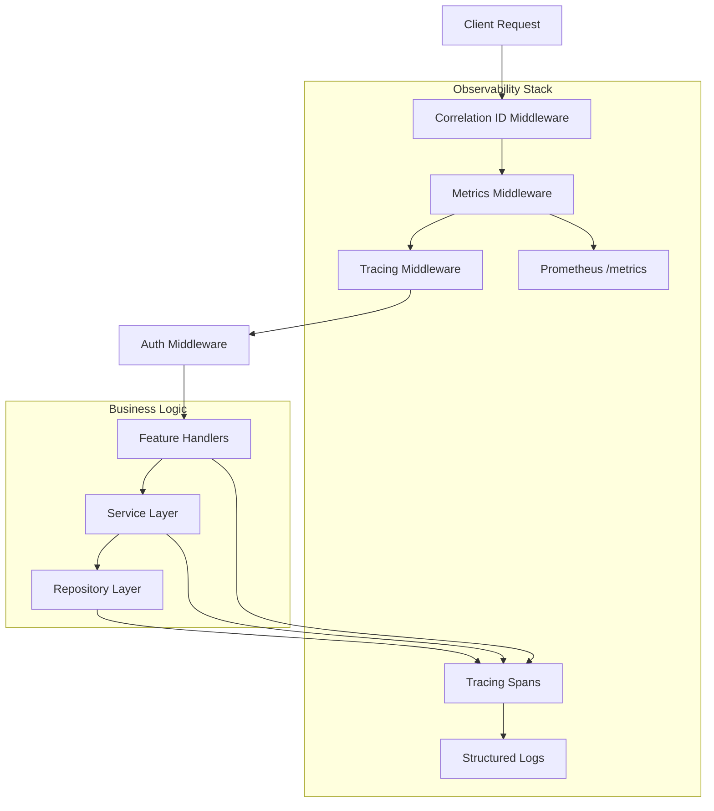

# Technical Solution Design - Enhanced Observability

## Overview

This design document describes the implementation of enhanced observability features for the Gateway Service, including structured logging with correlation IDs, Prometheus metrics collection, and enhanced health check endpoints.

**Related Requirement**: Requirement 5 - Monitoring and Observability

**Implementation Scope**: Phase 1 (MVP) - Production Readiness

## Architecture Overview

Enhanced observability is implemented as a **cross-cutting concern** using the middleware pattern, following the 3-layer architecture principles while providing observability across all layers.



## Technology Stack

### Core Dependencies

| Component | Library | Version | Purpose |
|-----------|---------|---------|---------|
| Structured Logging | `tracing` | 0.1 | ✅ Already included |
| Log Formatting | `tracing-subscriber` | 0.1 | ✅ Already included |
| HTTP Tracing | `tower-http` | 0.5 | 🆕 Request tracing middleware |
| Correlation ID | `uuid` | 1.0 | 🆕 Request ID generation |
| Metrics | `axum-prometheus` | 0.7 | 🆕 Prometheus metrics collection |

### Why These Libraries?

- **`tracing`**: Industry standard for structured logging in Rust, already in use
- **`tower-http`**: Official Axum middleware for HTTP tracing, seamless integration
- **`uuid`**: Standard UUID generation, lightweight and fast
- **`axum-prometheus`**: High-level wrapper for Axum, automatic HTTP metrics collection

## Module Structure

Following the 3-layer architecture guide, observability components are organized as:

```
gateway/src/
├── core/
│   ├── tracing.rs          # 🆕 Tracing initialization and configuration
│   ├── metrics.rs          # 🆕 Metrics registry and custom metrics
│   └── correlation.rs      # 🆕 Correlation ID types and utilities
├── middleware/
│   ├── correlation_id.rs   # 🆕 Correlation ID middleware
│   └── mod.rs              # 🔄 Export new middleware
└── features/
    └── health/
        ├── handler.rs      # 🔄 Enhanced /health endpoint
        ├── ready.rs        # 🆕 New /ready endpoint
        ├── service.rs      # 🆕 Health check business logic
        └── models.rs       # 🔄 Health check response models
```

## Design Details

### 1. Correlation ID Strategy

#### Dual-ID System

**Core Principle**: System always generates its own Request ID, while preserving client-provided Correlation ID for cross-system tracing.

**Error Handling Strategy**: Middleware is fail-safe and never blocks requests due to correlation ID issues.

```rust
/// Request context with dual correlation IDs
#[derive(Debug, Clone)]
pub struct RequestContext {
    /// System-generated unique request ID (always present)
    pub request_id: String,
    
    /// Optional client-provided correlation ID for cross-system tracing
    pub client_correlation_id: Option<String>,
    
    /// Timestamp when request was received
    pub timestamp: DateTime<Utc>,
}
```

#### HTTP Header Strategy

**Request Headers** (from client):
- `X-Correlation-ID` (optional) - Client's correlation ID for cross-system tracing

**Response Headers** (to client):
- `X-Request-ID` (always) - System-generated unique request ID
- `X-Correlation-ID` (if provided) - Echo back client's correlation ID

#### Behavior Matrix

| Client Provides | System Behavior | Response Headers |
|----------------|-----------------|------------------|
| ✅ `X-Correlation-ID: client-abc-123` | Generate new Request ID<br>Preserve client ID | `X-Request-ID: <uuid>`<br>`X-Correlation-ID: client-abc-123` |
| ❌ No header | Generate new Request ID<br>No client ID | `X-Request-ID: <uuid>` |

#### Middleware Error Handling

**Fail-Safe Design**: Correlation ID middleware never fails or blocks requests.

```rust
// middleware/correlation_id.rs
pub async fn correlation_id_middleware(
    mut request: Request<Body>,
    next: Next,
) -> Response {
    // 1. Generate request_id with fallback strategy
    let request_id = Uuid::new_v4()
        .map(|uuid| uuid.to_string())
        .unwrap_or_else(|e| {
            tracing::error!("UUID generation failed: {:?}, using timestamp fallback", e);
            format!("req-{}", chrono::Utc::now().timestamp_nanos())
        });

    // 2. Extract client_correlation_id with validation
    let client_correlation_id = request
        .headers()
        .get("X-Correlation-ID")
        .and_then(|v| v.to_str().ok())  // Ignore invalid UTF-8
        .and_then(|s| {
            // Validate length (prevent malicious long IDs)
            if s.len() <= 256 && !s.is_empty() {
                Some(s.to_string())
            } else {
                tracing::warn!("Invalid client correlation ID: length={}", s.len());
                None
            }
        });

    // 3. Create RequestContext (always succeeds)
    let request_context = RequestContext {
        request_id: request_id.clone(),
        client_correlation_id: client_correlation_id.clone(),
        timestamp: chrono::Utc::now(),
    };

    // 4. Inject into Extensions
    request.extensions_mut().insert(request_context);

    // 5. Process request
    let mut response = next.run(request).await;

    // 6. Add response headers (best effort, never fail)
    if let Ok(header_value) = HeaderValue::from_str(&request_id) {
        response.headers_mut().insert("X-Request-ID", header_value);
    }

    if let Some(client_id) = client_correlation_id {
        if let Ok(header_value) = HeaderValue::from_str(&client_id) {
            response.headers_mut().insert("X-Correlation-ID", header_value);
        }
    }

    response
}
```

**Error Handling Guarantees**:
- ✅ UUID generation failure → Timestamp fallback
- ✅ Invalid header encoding → Ignore client ID, use system ID only
- ✅ Malicious long IDs → Reject and log warning
- ✅ Header creation failure → Log error, continue without header
- ✅ Never returns error → Request always proceeds

#### Log Format

**With client correlation ID**:
```json
{
  "timestamp": "2024-01-15T10:30:00Z",
  "level": "INFO",
  "request_id": "550e8400-e29b-41d4-a716-446655440000",
  "client_correlation_id": "client-abc-123",
  "message": "Processing ingress request",
  "user_id": "user-123",
  "endpoint": "/api/v1/route",
  "method": "POST"
}
```

**Without client correlation ID**:
```json
{
  "timestamp": "2024-01-15T10:30:00Z",
  "level": "INFO",
  "request_id": "660f9511-f39c-52e5-b827-557766551111",
  "message": "Processing ingress request",
  "user_id": "user-456",
  "endpoint": "/api/v1/route",
  "method": "POST"
}
```

### 2. Structured Logging with Tracing

#### Accessing RequestContext in Business Logic

**Strategy**: Hybrid approach - automatic propagation via tracing spans + explicit access when needed.

**Approach A: Automatic Propagation (Default)** ⭐

```rust
// Handler Layer - Create root span with request_id
#[tracing::instrument(
    skip(state, request),
    fields(
        request_id = %request_context.request_id,
        client_correlation_id = ?request_context.client_correlation_id
    )
)]
pub async fn handle_ingress(
    Extension(request_context): Extension<RequestContext>,
    State(state): State<Arc<AppState>>,
    Json(request): Json<IngressRequest>,
) -> Result<Json<IngressResponse>, IngressError> {
    // request_id automatically available in all child spans
    state.ingress_service.process_request(request, user_id).await
}

// Service Layer - Inherits parent span fields
#[tracing::instrument(skip(self))]
pub async fn process_request(&self, ...) -> Result<...> {
    // Logs automatically include request_id from parent span
    tracing::info!("Processing ingress request");
}
```

**Approach B: Explicit Access (When Needed)**

```rust
// Handler Layer - Pass RequestContext explicitly
pub async fn handle_ingress(
    Extension(request_context): Extension<RequestContext>,
    ...
) -> Result<...> {
    // Pass to service when explicit access needed
    state.ingress_service
        .process_request(request, user_id, request_context)
        .await
}

// Service Layer - Receive and use RequestContext
impl IngressService {
    // ⚠️ IMPORTANT: When RequestContext is an explicit parameter,
    // DO NOT add request_id/client_correlation_id to #[tracing::instrument] fields
    // to avoid duplication in logs
    #[tracing::instrument(
        skip(self, request, request_context),  // Skip RequestContext to avoid duplication
        fields(
            user_id = %user_id,
            // ❌ DO NOT add: request_id = %request_context.request_id
            // ❌ DO NOT add: client_correlation_id = ?request_context.client_correlation_id
        )
    )]
    pub async fn process_request(
        &self,
        request: IngressRequest,
        user_id: String,
        request_context: RequestContext,  // Explicit parameter
    ) -> Result<IngressResponse, IngressError> {
        // Explicit logging with request_id (only when needed for specific events)
        tracing::info!(
            request_id = %request_context.request_id,
            client_correlation_id = ?request_context.client_correlation_id,
            "Processing request for user: {}", user_id
        );

        // Pass to external API headers
        let headers = vec![
            ("X-Request-ID", request_context.request_id.as_str()),
        ];

        self.repository.call_external_api(headers).await
    }
}
```

**Avoiding Duplication - Best Practices**:

| Scenario | Add to `#[tracing::instrument]` fields? | Rationale |
|----------|----------------------------------------|-----------|
| **Approach A** (automatic propagation) | ✅ Yes, in Handler layer only | Root span sets context for all children |
| **Approach B** (explicit parameter) | ❌ No, skip in `#[tracing::instrument]` | Already in parent span, avoid duplication |
| **Explicit logging** (specific events) | ✅ Yes, in individual `tracing::info!()` calls | Only when needed for specific events |

**Example - Correct Usage**:

```rust
// ✅ CORRECT: Handler creates root span with request_id
#[tracing::instrument(
    skip(state, request),
    fields(
        request_id = %request_context.request_id,           // ✅ Add here (root span)
        client_correlation_id = ?request_context.client_correlation_id
    )
)]
pub async fn handle_ingress(
    Extension(request_context): Extension<RequestContext>,
    ...
) -> Result<...> {
    // All child spans automatically inherit request_id
    state.ingress_service.process_request(request, user_id).await
}

// ✅ CORRECT: Service inherits from parent span
#[tracing::instrument(
    skip(self),
    // ❌ DO NOT add request_id here - already in parent span
)]
pub async fn process_request(&self, ...) -> Result<...> {
    // Logs automatically include request_id from parent span
    tracing::info!("Processing request");
}

// ✅ CORRECT: Explicit logging only when needed
pub async fn call_external_api(&self, request_context: RequestContext) -> Result<...> {
    // Only log request_id when passing to external API
    tracing::debug!(
        request_id = %request_context.request_id,
        "Calling external API with request ID"
    );

    let headers = vec![("X-Request-ID", request_context.request_id.as_str())];
    // ...
}
```

**Example - Incorrect Usage (Causes Duplication)**:

```rust
// ❌ INCORRECT: Duplication in logs
#[tracing::instrument(
    skip(state, request),
    fields(
        request_id = %request_context.request_id,  // Added in root span
    )
)]
pub async fn handle_ingress(...) -> Result<...> {
    state.ingress_service.process_request(request, user_id, request_context).await
}

// ❌ INCORRECT: Adds request_id again (duplication!)
#[tracing::instrument(
    skip(self, request_context),
    fields(
        request_id = %request_context.request_id,  // ❌ Duplicate!
    )
)]
pub async fn process_request(
    &self,
    request: IngressRequest,
    user_id: String,
    request_context: RequestContext,
) -> Result<...> {
    // This will cause request_id to appear twice in logs
}
```

**Log Output Comparison**:

**✅ Correct (No Duplication)**:
```json
{
  "timestamp": "2024-01-15T10:30:00Z",
  "level": "INFO",
  "request_id": "550e8400-e29b-41d4-a716-446655440000",
  "client_correlation_id": "client-abc-123",
  "span": "ingress_handler",
  "message": "Processing request"
}
```

**❌ Incorrect (With Duplication)**:
```json
{
  "timestamp": "2024-01-15T10:30:00Z",
  "level": "INFO",
  "request_id": "550e8400-e29b-41d4-a716-446655440000",
  "request_id": "550e8400-e29b-41d4-a716-446655440000",  // ❌ Duplicate!
  "client_correlation_id": "client-abc-123",
  "client_correlation_id": "client-abc-123",  // ❌ Duplicate!
  "span": "ingress_handler",
  "message": "Processing request"
}
```

**Recommendation**:
- Use **Approach A** (automatic) for most logging
  - Add `request_id` to `#[tracing::instrument]` fields **only in Handler layer**
  - Child spans automatically inherit from parent
- Use **Approach B** (explicit) only when:
  - Passing request_id to external API headers
  - Custom business logic needs correlation ID
  - Testing requires mock RequestContext
  - **Important**: Skip `request_id` in `#[tracing::instrument]` fields to avoid duplication

#### Tracing Spans Hierarchy

```
Request Span (request_id, client_correlation_id, endpoint, method)
  ├── Auth Span (user_id, auth_method)
  ├── Handler Span (feature_name, handler_name)
  │   ├── Service Span (operation_name)
  │   │   └── Repository Span (data_source, operation)
  │   │       └── External Call Span (service_name, method)
  └── Response Span (status_code, duration_ms)
```

#### Span Instrumentation Pattern

**Rule**: Add `request_id` and `client_correlation_id` **only in the Handler layer (root span)**. All child spans automatically inherit these fields.

```rust
// Handler Layer - ROOT SPAN (add request_id here)
#[tracing::instrument(
    name = "ingress_handler",
    skip(state, request),
    fields(
        request_id = %request_context.request_id,              // ✅ Add in root span
        client_correlation_id = ?request_context.client_correlation_id,  // ✅ Add in root span
        endpoint = "/api/v1/route"
    )
)]
pub async fn handle_ingress(
    State(state): State<Arc<AppState>>,
    Extension(request_context): Extension<RequestContext>,
    Json(request): Json<IngressRequest>,
) -> Result<Json<IngressResponse>, IngressError> {
    // Business logic
}

// Service Layer - CHILD SPAN (DO NOT add request_id)
#[tracing::instrument(
    name = "process_request",
    skip(self, request),
    fields(
        user_id = %user_id,
        prompt_length = request.prompt.len()
        // ❌ DO NOT add: request_id = %request_context.request_id
        // ❌ DO NOT add: client_correlation_id = ?request_context.client_correlation_id
    )
)]
pub async fn process_request(
    &self,
    request: IngressRequest,
    user_id: String,
) -> Result<IngressResponse, IngressError> {
    // Business logic
    // Logs automatically include request_id from parent span
}

// Repository Layer - CHILD SPAN (DO NOT add request_id)
#[tracing::instrument(
    name = "execute_llm",
    skip(self, plan, payload),
    fields(
        vendor_id = %plan.vendor_id,
        model_id = %plan.model_id
        // ❌ DO NOT add: request_id
    )
)]
pub async fn execute_llm_call(
    &self,
    plan: &RoutePlan,
    payload: &serde_json::Value,
) -> Result<LLMExecutionResult, IngressError> {
    // LLM execution
    // Logs automatically include request_id from root span
}
```

**Span Hierarchy with Automatic Propagation**:

```
Root Span: ingress_handler
  ├─ request_id: "550e8400-..."           ← Set here (Handler layer)
  ├─ client_correlation_id: "client-123"  ← Set here (Handler layer)
  ├─ endpoint: "/api/v1/route"
  │
  └─ Child Span: process_request
      ├─ user_id: "user-456"
      ├─ prompt_length: 100
      ├─ request_id: "550e8400-..."       ← Inherited from parent
      ├─ client_correlation_id: "client-123"  ← Inherited from parent
      │
      └─ Child Span: execute_llm
          ├─ vendor_id: "openai"
          ├─ model_id: "gpt-3.5-turbo"
          ├─ request_id: "550e8400-..."   ← Inherited from root
          └─ client_correlation_id: "client-123"  ← Inherited from root
```

**Key Principles**:
1. ✅ **Root span only**: Add `request_id` and `client_correlation_id` in Handler layer
2. ✅ **Automatic inheritance**: All child spans inherit from parent
3. ❌ **No duplication**: Never add `request_id` in Service or Repository layers
4. ✅ **Layer-specific fields**: Each layer adds its own relevant fields (user_id, vendor_id, etc.)

#### Tracing Subscriber Configuration

```rust
// core/tracing.rs
use tracing_subscriber::{fmt, EnvFilter, prelude::*};

/// Tracing configuration from environment
#[derive(Debug, Clone)]
pub struct TracingConfig {
    pub env_filter: String,
    pub format: LogFormat,
    pub with_line_number: bool,    // Expensive in production
    pub with_thread_ids: bool,     // Expensive in production
    pub with_target: bool,
    pub with_current_span: bool,
    pub with_span_list: bool,
}

#[derive(Debug, Clone)]
pub enum LogFormat {
    Json,
    Pretty,
}

impl TracingConfig {
    /// Load configuration from environment variables
    pub fn from_env() -> Self {
        let env_filter = std::env::var("RUST_LOG")
            .unwrap_or_else(|_| "info".to_string());

        let format = match std::env::var("LOG_FORMAT").as_deref() {
            Ok("pretty") => LogFormat::Pretty,
            _ => LogFormat::Json,
        };

        // Verbose debug mode (development only)
        let verbose_debug = std::env::var("LOG_VERBOSE_DEBUG")
            .map(|v| v == "true" || v == "1")
            .unwrap_or(false);

        Self {
            env_filter,
            format,
            with_line_number: verbose_debug,   // Only in verbose mode
            with_thread_ids: verbose_debug,    // Only in verbose mode
            with_target: true,
            with_current_span: true,
            with_span_list: true,
        }
    }
}

/// Initialize tracing with environment-based configuration
pub fn init_tracing() -> Result<(), Box<dyn std::error::Error>> {
    let config = TracingConfig::from_env();

    let env_filter = EnvFilter::try_from_default_env()
        .unwrap_or_else(|_| EnvFilter::new(&config.env_filter));

    match config.format {
        LogFormat::Json => {
            let fmt_layer = fmt::layer()
                .json()
                .with_target(config.with_target)
                .with_current_span(config.with_current_span)
                .with_span_list(config.with_span_list)
                .with_line_number(config.with_line_number)
                .with_thread_ids(config.with_thread_ids);

            tracing_subscriber::registry()
                .with(env_filter)
                .with(fmt_layer)
                .init();
        }
        LogFormat::Pretty => {
            let fmt_layer = fmt::layer()
                .pretty()
                .with_target(config.with_target)
                .with_line_number(config.with_line_number)
                .with_thread_ids(config.with_thread_ids);

            tracing_subscriber::registry()
                .with(env_filter)
                .with(fmt_layer)
                .init();
        }
    }

    tracing::info!(
        "Tracing initialized: format={:?}, verbose_debug={}",
        config.format,
        config.with_line_number
    );

    Ok(())
}
```

**Performance Considerations**:
- `with_line_number` and `with_thread_ids` add ~10-20% overhead in production
- These are disabled by default, enabled only with `LOG_VERBOSE_DEBUG=true`
- Production should use `LOG_FORMAT=json` and `LOG_VERBOSE_DEBUG=false`

### 3. Prometheus Metrics

#### Automatic HTTP Metrics (via axum-prometheus)

**Metrics automatically collected**:
- `http_requests_total` - Total HTTP requests (counter)
- `http_requests_duration_seconds` - Request duration histogram
- `http_requests_pending` - In-flight requests (gauge)

**Labels**:
- `method` - HTTP method (GET, POST, etc.)
- `endpoint` - Request path
- `status` - HTTP status code

#### Custom Business Metrics (Future)

```rust
// core/metrics.rs
use prometheus::{IntCounter, Histogram, Registry};

pub struct CustomMetrics {
    // LLM execution metrics
    pub llm_requests_total: IntCounter,
    pub llm_tokens_total: IntCounter,
    pub llm_cost_total: Histogram,
    
    // Executor metrics
    pub executor_retries_total: IntCounter,
    pub executor_fallbacks_total: IntCounter,
}

impl CustomMetrics {
    pub fn new(registry: &Registry) -> Result<Self, prometheus::Error> {
        // Register custom metrics
        // Implementation in Phase 2
    }
}
```

#### Metrics Endpoint

- **Path**: `/metrics`
- **Format**: Prometheus text format
- **Access**: Public (should be restricted in production via network policies)

### 4. Enhanced Health Check

#### `/health` Endpoint (Liveness Probe)

**Purpose**: Check if the application is alive and running

**Response**:
```json
{
  "status": "healthy",
  "timestamp": "2024-01-15T10:30:00Z",
  "version": "0.1.0",
  "uptime_seconds": 3600
}
```

**HTTP Status**:
- `200 OK` - Always (unless server is completely down)

#### `/ready` Endpoint (Readiness Probe)

**Purpose**: Check if the application is ready to serve traffic

**Design Decision**: Hybrid approach with configurable health check mode

**Rationale**:
- ✅ **Production Readiness**: "Ready" should mean "able to handle requests", not just "configured correctly"
- ✅ **Kubernetes Best Practice**: Readiness probe should check actual dependencies
- ✅ **Fast Failure**: If OpenAI is down, Kubernetes should stop routing traffic
- ✅ **Flexibility**: Development can use config-only check (fast), production uses connectivity check

**Phase 1: Hybrid Approach** (Configurable via Environment Variable)

**Response Format**:

**Mode: `config` (Configuration Check)**:
```json
{
  "status": "ready",
  "timestamp": "2024-01-15T10:30:00Z",
  "dependencies": {
    "executor": {
      "status": "healthy",
      "check_type": "config",
      "vendor_count": 1,
      "last_check": "2024-01-15T10:30:00Z"
    }
  }
}
```

**Mode: `connectivity` (Connectivity Check - Healthy)**:
```json
{
  "status": "ready",
  "timestamp": "2024-01-15T10:30:00Z",
  "dependencies": {
    "executor": {
      "status": "healthy",
      "check_type": "connectivity",
      "vendor_count": 1,
      "latency_ms": 45,
      "last_check": "2024-01-15T10:30:00Z"
    }
  }
}
```

**Mode: `connectivity` (Connectivity Check - Unhealthy)**:
```json
{
  "status": "not_ready",
  "timestamp": "2024-01-15T10:30:00Z",
  "dependencies": {
    "executor": {
      "status": "unhealthy",
      "check_type": "connectivity",
      "vendor_count": 1,
      "error": "Health check failed: Network timeout",
      "last_check": "2024-01-15T10:30:00Z"
    }
  }
}
```

**Environment Variable Configuration**:

```bash
# Health check mode: "config" or "connectivity"
# - "config": Only check if vendors are configured (fast, no API calls)
# - "connectivity": Check actual API connectivity (recommended for production)
HEALTH_CHECK_MODE=connectivity

# Health check cache TTL (seconds)
# Reduces API calls by caching health check results
HEALTH_CHECK_CACHE_TTL=30

# Health check timeout (seconds)
HEALTH_CHECK_TIMEOUT=2
```

**Implementation** (Phase 1 - Hybrid Approach):

```rust
// features/health/service.rs
use std::sync::Arc;
use tokio::sync::RwLock;
use std::collections::HashMap;
use std::time::Instant;

/// Cached health check result
#[derive(Clone)]
struct CachedHealth {
    status: DependencyStatus,
    timestamp: Instant,
}

pub struct HealthService {
    executor_service: Arc<ExecutorService>,
    config: HealthConfig,
    /// Health check cache (reduces API calls)
    health_cache: Arc<RwLock<HashMap<String, CachedHealth>>>,
}

#[derive(Clone)]
pub struct HealthConfig {
    /// Health check mode: "config" or "connectivity"
    pub mode: HealthCheckMode,
    /// Cache TTL in seconds
    pub cache_ttl: u64,
    /// Health check timeout in seconds
    pub timeout: u64,
}

#[derive(Clone, PartialEq)]
pub enum HealthCheckMode {
    Config,        // Only check configuration
    Connectivity,  // Check actual API connectivity
}

impl HealthService {
    pub fn new(executor_service: Arc<ExecutorService>, config: HealthConfig) -> Self {
        Self {
            executor_service,
            config,
            health_cache: Arc::new(RwLock::new(HashMap::new())),
        }
    }

    pub async fn check_readiness(&self) -> ReadinessResponse {
        let executor_status = match self.config.mode {
            HealthCheckMode::Config => {
                // Fast config-only check (development)
                self.check_executor_config()
            }
            HealthCheckMode::Connectivity => {
                // Actual connectivity check with cache (production)
                self.check_executor_health_with_cache().await
            }
        };

        ReadinessResponse {
            status: if executor_status.is_healthy() { "ready" } else { "not_ready" },
            timestamp: chrono::Utc::now(),
            dependencies: hashmap! {
                "executor" => executor_status,
            },
        }
    }

    /// Fast configuration check (no API calls)
    fn check_executor_config(&self) -> DependencyStatus {
        let vendor_count = self.executor_service.get_vendor_count();

        DependencyStatus {
            status: if vendor_count > 0 { "healthy" } else { "unhealthy" },
            check_type: "config",
            vendor_count: Some(vendor_count),
            error: if vendor_count == 0 { Some("No vendors configured".to_string()) } else { None },
            latency_ms: None,
            last_check: Some(chrono::Utc::now()),
        }
    }

    /// Connectivity check with cache (reduces API calls)
    async fn check_executor_health_with_cache(&self) -> DependencyStatus {
        // 1. Check cache first
        {
            let cache = self.health_cache.read().await;
            if let Some(cached) = cache.get("executor") {
                let age = cached.timestamp.elapsed().as_secs();
                if age < self.config.cache_ttl {
                    // Cache hit - return cached result
                    tracing::debug!(
                        cache_age_seconds = age,
                        "Health check cache hit"
                    );
                    return cached.status.clone();
                }
            }
        }

        // 2. Cache miss - perform actual health check
        tracing::debug!("Health check cache miss, performing actual check");

        let status = match tokio::time::timeout(
            Duration::from_secs(self.config.timeout),
            self.executor_service.health_check()
        ).await {
            Ok(Ok(latency)) => {
                let vendor_count = self.executor_service.get_vendor_count();
                DependencyStatus {
                    status: "healthy",
                    check_type: "connectivity",
                    vendor_count: Some(vendor_count),
                    latency_ms: Some(latency),
                    error: None,
                    last_check: Some(chrono::Utc::now()),
                }
            }
            Ok(Err(e)) => DependencyStatus {
                status: "unhealthy",
                check_type: "connectivity",
                vendor_count: Some(self.executor_service.get_vendor_count()),
                latency_ms: None,
                error: Some(format!("Health check failed: {}", e)),
                last_check: Some(chrono::Utc::now()),
            },
            Err(_) => DependencyStatus {
                status: "unhealthy",
                check_type: "connectivity",
                vendor_count: Some(self.executor_service.get_vendor_count()),
                latency_ms: None,
                error: Some(format!("Health check timeout ({}s)", self.config.timeout)),
                last_check: Some(chrono::Utc::now()),
            },
        };

        // 3. Update cache
        {
            let mut cache = self.health_cache.write().await;
            cache.insert("executor".to_string(), CachedHealth {
                status: status.clone(),
                timestamp: Instant::now(),
            });
        }

        status
    }
}

/// Dependency status with check type
#[derive(Clone, Serialize)]
pub struct DependencyStatus {
    pub status: &'static str,
    pub check_type: &'static str,  // "config" or "connectivity"
    #[serde(skip_serializing_if = "Option::is_none")]
    pub vendor_count: Option<usize>,
    #[serde(skip_serializing_if = "Option::is_none")]
    pub latency_ms: Option<u64>,
    #[serde(skip_serializing_if = "Option::is_none")]
    pub error: Option<String>,
    #[serde(skip_serializing_if = "Option::is_none")]
    pub last_check: Option<chrono::DateTime<chrono::Utc>>,
}

impl DependencyStatus {
    fn is_healthy(&self) -> bool {
        self.status == "healthy"
    }
}
```

**ExecutorService - Lightweight Health Check**:

```rust
// features/executor/service.rs
impl ExecutorService {
    /// Lightweight health check - verifies vendor connectivity
    ///
    /// Uses minimal API calls (e.g., GET /models) to verify connectivity
    /// without consuming LLM tokens or incurring significant costs.
    ///
    /// # Returns
    /// - `Ok(latency_ms)` if at least one vendor is healthy
    /// - `Err(ExecutorError)` if all vendors are unhealthy
    pub async fn health_check(&self) -> Result<u64, ExecutorError> {
        let start = Instant::now();

        // Check all vendors in parallel
        let checks: Vec<_> = self.repository.vendors.iter()
            .map(|vendor| vendor.health_check())
            .collect();

        let results = futures::future::join_all(checks).await;

        // At least one vendor healthy = overall healthy (degraded mode)
        let healthy_count = results.iter().filter(|r| r.is_ok()).count();

        if healthy_count > 0 {
            let latency = start.elapsed().as_millis() as u64;
            tracing::info!(
                healthy_vendors = healthy_count,
                total_vendors = results.len(),
                latency_ms = latency,
                "Executor health check passed"
            );
            Ok(latency)
        } else {
            tracing::error!(
                total_vendors = results.len(),
                "All vendors unhealthy"
            );
            Err(ExecutorError::AllVendorsUnhealthy)
        }
    }

    pub fn get_vendor_count(&self) -> usize {
        self.repository.vendors.len()
    }
}
```

**OpenAI Vendor - Lightweight Health Check**:

```rust
// features/executor/vendors/openai.rs
impl OpenAIVendor {
    /// Lightweight health check using GET /models endpoint
    ///
    /// This is a minimal API call that:
    /// - Does not consume tokens
    /// - Has minimal cost (usually free)
    /// - Verifies API key validity and connectivity
    pub async fn health_check(&self) -> Result<(), VendorError> {
        let url = format!("{}/models", self.base_url);

        let response = self.client
            .get(&url)
            .header("Authorization", format!("Bearer {}", self.api_key))
            .timeout(Duration::from_secs(1))  // 1 second timeout
            .send()
            .await
            .map_err(|e| VendorError::NetworkError(e.to_string()))?;

        if response.status().is_success() {
            tracing::debug!(
                vendor = "openai",
                status = %response.status(),
                "Health check passed"
            );
            Ok(())
        } else {
            tracing::warn!(
                vendor = "openai",
                status = %response.status(),
                "Health check failed"
            );
            Err(VendorError::HealthCheckFailed(response.status()))
        }
    }
}
```

**Configuration Comparison**:

| Environment | `HEALTH_CHECK_MODE` | Check Type | Latency | API Call Frequency | Use Case |
|-------------|---------------------|------------|---------|-------------------|----------|
| **Development** | `config` | Configuration only | < 1ms | None | Fast iteration, no external deps |
| **Production** | `connectivity` | Actual API calls | ~50-100ms | Every 30s (cached) | True readiness check |
| **Testing** | `config` | Configuration only | < 1ms | None | Fast test execution |
| **Staging** | `connectivity` | Actual API calls | ~50-100ms | Every 30s (cached) | Production-like testing |

**Cache Effectiveness**:

```
Kubernetes readinessProbe (periodSeconds: 10)
  ↓ Every 10 seconds
Health Check Cache (TTL: 30 seconds)
  ↓ Cache hit for 20 seconds
Actual API Call
  ↓ Every 30 seconds (cache miss)

Result: 66% reduction in API calls (3 probes → 1 API call)
```

**Kubernetes Integration**:

```yaml
# deployment.yaml
apiVersion: apps/v1
kind: Deployment
metadata:
  name: gateway
spec:
  template:
    spec:
      containers:
      - name: gateway
        image: gateway:latest
        env:
          # Production: Use connectivity check
          - name: HEALTH_CHECK_MODE
            value: "connectivity"
          - name: HEALTH_CHECK_CACHE_TTL
            value: "30"
          - name: HEALTH_CHECK_TIMEOUT
            value: "2"

        # Liveness probe - check if app is alive
        livenessProbe:
          httpGet:
            path: /health
            port: 3000
          initialDelaySeconds: 10
          periodSeconds: 30
          timeoutSeconds: 5
          failureThreshold: 3

        # Readiness probe - check if app can serve traffic
        readinessProbe:
          httpGet:
            path: /ready
            port: 3000
          initialDelaySeconds: 5
          periodSeconds: 10        # Check every 10 seconds
          timeoutSeconds: 3        # 3 second timeout
          successThreshold: 1      # 1 success = ready
          failureThreshold: 3      # 3 failures = not ready
```

**Behavior in Production**:

| Scenario | Health Check Result | Kubernetes Action | User Impact |
|----------|-------------------|-------------------|-------------|
| **All vendors healthy** | `200 OK` | Route traffic normally | ✅ Requests succeed |
| **OpenAI API down** | `503 Service Unavailable` | Stop routing to this Pod | ✅ Traffic goes to healthy Pods |
| **Network timeout** | `503 Service Unavailable` | Stop routing to this Pod | ✅ Fast failure, no user impact |
| **Config error (no vendors)** | `503 Service Unavailable` | Stop routing to this Pod | ✅ Prevents misconfigured Pods |

**HTTP Status Codes**:
- `200 OK` - All dependencies healthy (ready to serve traffic)
- `503 Service Unavailable` - One or more dependencies unhealthy (not ready)

**Phase 2 Enhancements** (Future):

| Dependency | Phase 1 | Phase 2 | Check Method |
|-----------|---------|---------|--------------|
| **Executor Layer** | ✅ Connectivity | ✅ Connectivity | Lightweight API call (GET /models) |
| **Router Service** | ❌ | ✅ | gRPC health check |
| **Memory Service** | ❌ | ✅ | gRPC health check |
| **Database** | ❌ | ⏸️ | Connection pool status |

## Implementation Flow

### Middleware Stack Order

```rust
// main.rs
let app = Router::new()
    .route("/api/v1/route", post(ingress_handler))
    .route("/health", get(health_handler))
    .route("/ready", get(ready_handler))
    // Middleware stack (applied in reverse order)
    .layer(PrometheusMetricLayer::new())           // 4. Metrics collection
    .layer(TraceLayer::new_for_http())             // 3. HTTP tracing
    .layer(middleware::from_fn(correlation_id_middleware))  // 2. Correlation ID
    .layer(middleware::from_fn(auth_middleware))   // 1. Authentication
    .with_state(state);

// Metrics endpoint (no auth required)
let metrics_app = Router::new()
    .route("/metrics", get(metrics_handler));

// Combine apps
let final_app = app.merge(metrics_app);
```

### Request Processing Flow

```
1. Client Request
   ↓
2. Correlation ID Middleware
   - Generate request_id
   - Extract client_correlation_id (if present)
   - Inject RequestContext into request extensions
   ↓
3. Tracing Middleware
   - Create root span with request_id and client_correlation_id
   - Log request start
   ↓
4. Metrics Middleware
   - Start request timer
   - Increment in-flight requests counter
   ↓
5. Auth Middleware
   - Validate authentication
   - Add auth span
   ↓
6. Feature Handler
   - Add handler span
   - Delegate to service
   ↓
7. Service Layer
   - Add service span
   - Execute business logic
   ↓
8. Repository Layer
   - Add repository span
   - Execute data access
   ↓
9. Response
   - Log response status
   - Record metrics (duration, status)
   - Add X-Request-ID header
   - Add X-Correlation-ID header (if client provided)
```

## Configuration

### Environment Variables

```bash
# === Logging Configuration ===

# Log level (trace, debug, info, warn, error)
# Production: info
# Development: debug or trace
RUST_LOG=info,gateway=debug

# Log format (json, pretty)
# Production: json (for log aggregation)
# Development: pretty (for human readability)
LOG_FORMAT=json

# Verbose debug mode (true, false)
# Enables expensive logging options (line numbers, thread IDs)
# Production: false (10-20% performance impact)
# Development: true (helpful for debugging)
LOG_VERBOSE_DEBUG=false

# === Metrics Configuration ===

# Enable/disable metrics collection
METRICS_ENABLED=true

# Metrics endpoint path
METRICS_PATH=/metrics

# === Health Check Configuration ===

# Enable/disable health checks
HEALTH_CHECK_ENABLED=true

# Health check mode: "config" or "connectivity"
# - "config": Only check if vendors are configured (fast, no API calls)
#   Use for: Development, testing
# - "connectivity": Check actual API connectivity (recommended for production)
#   Use for: Production, staging
HEALTH_CHECK_MODE=connectivity

# Health check cache TTL (seconds)
# Reduces API calls by caching health check results
# Recommended: 30 seconds (balances freshness and API usage)
HEALTH_CHECK_CACHE_TTL=30

# Health check timeout (seconds)
# Maximum time to wait for health check response
# Recommended: 2 seconds (prevents blocking Kubernetes probes)
HEALTH_CHECK_TIMEOUT=2
```

### Example .env (Production)

```bash
# Observability - Production Configuration
RUST_LOG=info,gateway=info
LOG_FORMAT=json
LOG_VERBOSE_DEBUG=false
METRICS_ENABLED=true
HEALTH_CHECK_ENABLED=true
HEALTH_CHECK_MODE=connectivity      # ⭐ Use connectivity check in production
HEALTH_CHECK_CACHE_TTL=30
HEALTH_CHECK_TIMEOUT=2
```

### Example .env (Development)

```bash
# Observability - Development Configuration
RUST_LOG=debug,gateway=trace,tower_http=debug
LOG_FORMAT=pretty
LOG_VERBOSE_DEBUG=true
METRICS_ENABLED=true
HEALTH_CHECK_ENABLED=true
HEALTH_CHECK_MODE=config            # ⭐ Use config check in development (faster)
HEALTH_CHECK_CACHE_TTL=30
HEALTH_CHECK_TIMEOUT=2
```

### Example .env (Staging)

```bash
# Observability - Staging Configuration (Production-like)
RUST_LOG=info,gateway=debug
LOG_FORMAT=json
LOG_VERBOSE_DEBUG=false
METRICS_ENABLED=true
HEALTH_CHECK_ENABLED=true
HEALTH_CHECK_MODE=connectivity      # ⭐ Use connectivity check (same as production)
HEALTH_CHECK_CACHE_TTL=30
HEALTH_CHECK_TIMEOUT=2
```

### Performance Impact

| Configuration | Production | Development | Performance Impact |
|--------------|-----------|-------------|-------------------|
| `RUST_LOG=info` | ✅ | ❌ | Baseline |
| `RUST_LOG=debug` | ❌ | ✅ | ~5-10% overhead |
| `RUST_LOG=trace` | ❌ | ✅ | ~10-20% overhead |
| `LOG_FORMAT=json` | ✅ | ❌ | ~2-5% overhead |
| `LOG_FORMAT=pretty` | ❌ | ✅ | ~5-10% overhead |
| `LOG_VERBOSE_DEBUG=false` | ✅ | ❌ | Baseline |
| `LOG_VERBOSE_DEBUG=true` | ❌ | ✅ | ~10-20% overhead |
| `HEALTH_CHECK_MODE=config` | ❌ | ✅ | < 1ms per check |
| `HEALTH_CHECK_MODE=connectivity` | ✅ | ❌ | ~50-100ms per check (cached) |

## Testing Strategy

### Unit Tests

- ✅ Correlation ID generation and extraction
- ✅ RequestContext creation and propagation
- ✅ Health check service logic
- ✅ Readiness check dependency validation

### Integration Tests

- ✅ End-to-end request with correlation ID
- ✅ Metrics collection and exposure
- ✅ Health check endpoints
- ✅ Log format validation

### Manual Testing

```bash
# Test correlation ID propagation
curl -X POST http://localhost:3000/api/v1/route \
  -H "X-Correlation-ID: test-client-123" \
  -H "Content-Type: application/json" \
  -d '{"prompt": "Hello", "metadata": {}}'

# Expected response headers:
# X-Request-ID: <uuid>
# X-Correlation-ID: test-client-123

# Test metrics endpoint
curl http://localhost:3000/metrics

# Test health endpoints
curl http://localhost:3000/health
curl http://localhost:3000/ready
```

## Migration Plan

### Phase 1 (Current Implementation)

1. ✅ Add dependencies to Cargo.toml
2. ✅ Implement correlation ID middleware
3. ✅ Add tracing spans to all layers
4. ✅ Integrate axum-prometheus
5. ✅ Enhance health check endpoints
6. ✅ Update main.rs with middleware stack
7. ✅ Add integration tests

### Phase 2 (Future Enhancements)

- ⏸️ Distributed tracing with OpenTelemetry
- ⏸️ Custom business metrics (LLM cost, tokens)
- ⏸️ Grafana dashboard templates
- ⏸️ Alert rules for Prometheus
- ⏸️ Log aggregation (e.g., Loki, Elasticsearch)

## Benefits

### For Development

- ✅ Easy debugging with correlation IDs
- ✅ Complete request tracing across layers
- ✅ Structured logs for easy parsing

### For Operations

- ✅ Prometheus metrics for monitoring
- ✅ Health checks for Kubernetes probes
- ✅ Performance analysis with request duration

### For Users

- ✅ Request IDs for support tickets
- ✅ Cross-system tracing with correlation IDs
- ✅ Transparent error tracking

## Security Considerations

- ✅ Metrics endpoint should be restricted in production (network policies)
- ✅ Logs should not contain sensitive data (API keys, passwords)
- ✅ Correlation IDs are validated and sanitized
- ✅ Health check endpoints do not expose sensitive configuration

