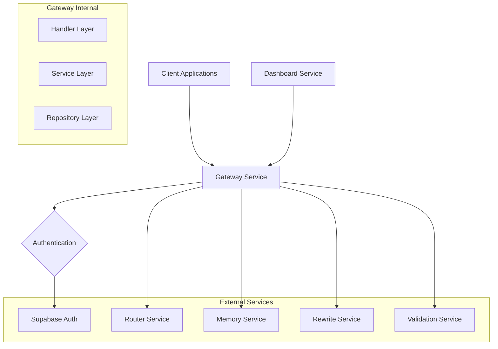

# Technical Solution Design

## Architecture Overview

The Gateway Microservice serves as the unified entry point for the AI API Router system,
implementing a layered architecture with strict separation of concerns. The service integrates with
Supabase for authentication while maintaining full control over business logic and service
coordination.

## Technology Stack

### Core Framework

- **Rust**: Primary programming language for performance and safety
- **Axum**: Web framework for HTTP server and routing
- **Tokio**: Async runtime for non-blocking I/O operations
- **Serde**: JSON serialization/deserialization

### Communication

- **Tonic**: gRPC client library for microservice communication
- **HTTP/REST**: External API interface (Dashboard, client requests)
- **gRPC**: Internal service communication

### Authentication & Security

- **jsonwebtoken**: JWT validation for Supabase tokens
- **reqwest**: HTTP client for Supabase public key fetching
- **tower-http**: Middleware for CORS, tracing, and authentication

### Observability

- **tracing**: Structured logging and distributed tracing
- **tracing-subscriber**: Log formatting and output
- **metrics**: Prometheus metrics collection
- **tower-http**: Request/response logging middleware

### Configuration

- **config**: Configuration management with hot reload support
- **serde**: Configuration serialization
- **tokio-watch**: Configuration change notifications

## System Architecture



## Module Structure

Following the backend development specifications, the Gateway service implements a 3-layer
architecture:

```
gateway/
├── src/
│   ├── lib.rs                  # Main library exports
│   ├── main.rs                 # Application entry point
│   ├── config/                 # Configuration management
│   │   ├── mod.rs
│   │   ├── settings.rs
│   │   └── hot_reload.rs
│   ├── core/                   # Reusable primitives
│   │   ├── mod.rs
│   │   ├── error.rs
│   │   ├── result.rs
│   │   └── tracing.rs
│   ├── features/               # Business-specific modules
│   │   ├── auth/
│   │   │   ├── mod.rs
│   │   │   ├── handler.rs      # Authentication handlers
│   │   │   ├── service.rs      # JWT validation logic
│   │   │   ├── repository.rs   # Supabase integration
│   │   │   └── models.rs       # Auth data structures
│   │   ├── chat/
│   │   │   ├── mod.rs
│   │   │   ├── handler.rs      # Chat endpoint handlers
│   │   │   ├── service.rs      # Request orchestration
│   │   │   ├── repository.rs   # gRPC client management
│   │   │   └── models.rs       # Request/response models
│   │   └── health/
│   │       ├── mod.rs
│   │       ├── handler.rs      # Health check endpoints
│   │       └── service.rs      # Health check logic
│   ├── middleware/             # HTTP middleware
│   │   ├── mod.rs
│   │   ├── auth.rs            # Authentication middleware
│   │   ├── tracing.rs         # Request tracing
│   │   └── metrics.rs         # Metrics collection
│   └── grpc/                  # gRPC client abstractions
│       ├── mod.rs
│       ├── clients.rs         # gRPC client pool
│       ├── router.rs          # Router service client
│       ├── memory.rs          # Memory service client
│       ├── rewrite.rs         # Rewrite service client
│       └── validation.rs      # Validation service client
```

## Data Flow Design

### Request Processing Flow

1. **HTTP Request Reception**
   - Client sends POST to `/api/v1/chat`
   - Axum router receives and routes to chat handler

2. **Authentication Middleware**
   - Extract JWT from Authorization header
   - Validate JWT signature against Supabase public keys
   - Extract user claims and roles
   - Inject user context into request

3. **Authorization Check**
   - Verify user has required permissions
   - Check rate limiting (future implementation)
   - Log access attempt

4. **Request Processing**
   - Parse request payload (prompt + metadata)
   - Determine service routing based on rewrite flag
   - Create correlation ID for tracing

5. **Service Coordination**
   - Retrieve context data from Memory Service first
   - If rewrite=true: Rewrite Service → Router Service (with context)
   - If rewrite=false: Direct to Router Service (with context)
   - Pass context data to Router Service for cache optimization
   - Parallel calls to Validation services as needed
   - Implement circuit breaker and retry logic

6. **Response Aggregation**
   - Collect responses from all services
   - Merge into unified response format
   - Add metadata (processing time, cache hit status, cost savings, etc.)
   - Update Memory Service with new conversation context

7. **Response Return**
   - Return JSON response to client with cost optimization info
   - Log request completion with cache hit metrics
   - Track cost savings for dashboard analytics

### Error Handling Flow

1. **Service Failures**
   - Implement circuit breaker pattern
   - Exponential backoff with jitter
   - Graceful degradation strategies

2. **Authentication Failures**
   - Return 401 with clear error messages
   - Log security events
   - Rate limit failed attempts

3. **Authorization Failures**
   - Return 403 with role-specific messages
   - Audit log access violations

## Security Design

### JWT Validation

- Validate signature using Supabase public keys
- Check token expiration and not-before claims
- Verify issuer matches Supabase project
- Handle key rotation gracefully

### API Key Management

- Separate API keys for service-to-service communication
- Store keys in environment variables
- Implement key rotation support

### RBAC Implementation

- Extract roles from JWT claims
- Map roles to permissions
- Endpoint-level authorization checks

## Gateway Mediation Pattern

### Service Coordination Strategy

- Gateway acts as the single point of coordination for all microservices
- All inter-service communication flows through Gateway
- Context data retrieved from Memory Service and passed to Router Service
- Unified error handling and retry logic across all service interactions
- Complete request tracing and monitoring through centralized flow

### Benefits of Mediation Pattern

- **Loose Coupling**: Services only need to know about Gateway
- **Unified Observability**: All data flows are traceable
- **Consistent Error Handling**: Centralized retry and circuit breaker logic
- **Flexible Data Processing**: Gateway can validate, transform, and cache context data
- **Security**: Single authentication and authorization point

## Performance Considerations

### Async Architecture

- Full async/await implementation
- Non-blocking I/O for all operations
- Connection pooling for gRPC clients
- Parallel processing where possible (validation, logging)

### Caching Strategy

- Cache Supabase public keys with TTL
- Cache user role mappings
- Cache frequently accessed context data for performance
- Implement cache invalidation and TTL management

### Resource Management

- Connection pool limits
- Request timeout configurations
- Memory usage monitoring

## Deployment Architecture

### Configuration Management

- Environment variable injection
- Configuration file support
- Hot reload capability
- Validation on startup

### Health Checks

- `/health`: Basic service health
- `/ready`: Readiness for traffic
- Dependency health checks

### Observability

- Structured logging with correlation IDs
- Prometheus metrics export
- Distributed tracing support
- Error rate and latency monitoring

## Testing Strategy

### Unit Testing

- Service layer business logic
- Authentication/authorization logic
- Configuration management
- Error handling scenarios

### Integration Testing

- gRPC client interactions
- JWT validation flows
- End-to-end request processing
- Health check endpoints

### Load Testing

- Concurrent request handling
- Service coordination under load
- Circuit breaker activation
- Resource usage patterns
