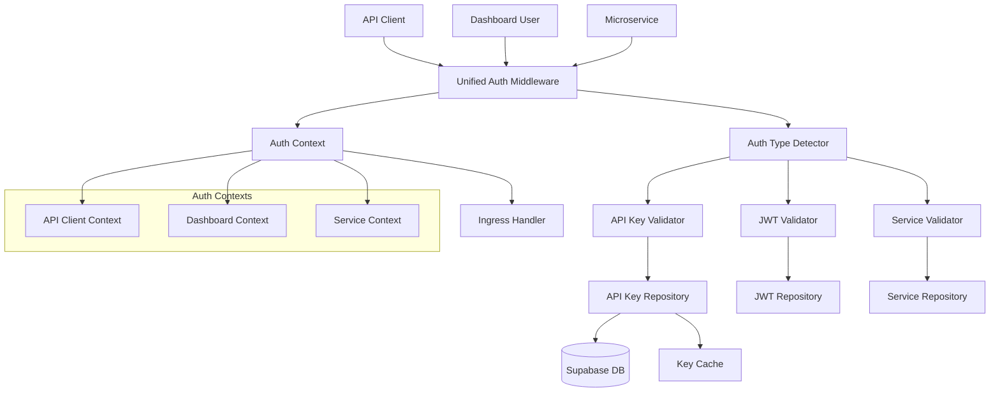

# Technical Solution Design

## Architecture Overview

The Unified Authentication System implements a hybrid middleware-based architecture supporting
multiple authentication methods for different client types. The system integrates seamlessly with
the existing Gateway service while providing specialized authentication flows for Dashboard users,
API clients, and internal microservices.

## Authentication Scenarios

### 1. API Client Authentication (Primary Focus)

- **Use Case**: B2B customers calling AI API Router endpoints
- **Method**: Long-lived API Keys
- **Context**: Client ID, Organization ID, Project ID
- **Performance**: High-throughput, low-latency validation

### 2. Dashboard User Authentication (Future)

- **Use Case**: Web dashboard login and session management
- **Method**: JWT tokens with Supabase integration
- **Context**: User ID, Organization ID, Project permissions
- **Features**: Login/logout, session management, RBAC

### 3. Microservice Authentication (Future)

- **Use Case**: Internal service-to-service communication
- **Method**: Internal JWT tokens
- **Context**: Service name, Request ID
- **Features**: Lightweight, high-performance validation

## Technology Stack

### Phase 1: API Key Authentication

- **Database**: Supabase (PostgreSQL) for API key storage
- **Cache**: moka for high-performance key validation caching
- **Validation**: Custom API key validation logic
- **Integration**: Axum middleware for request interception

### Phase 2: JWT Authentication (Future)

- **JWT Library**: jsonwebtoken for token validation
- **Key Management**: Supabase public key fetching
- **Session**: Redis for session management
- **Integration**: Extended middleware for JWT validation

### Phase 3: Internal Authentication (Future)

- **Internal JWT**: Lightweight service tokens
- **Key Management**: Shared secret or internal PKI
- **Performance**: Minimal validation overhead

## System Architecture



## Module Structure

Following the 3-layer architecture pattern from backend development specifications:

```
gateway/src/
├── features/
│   └── auth/                   # Authentication feature (3-layer architecture)
│       ├── mod.rs              # Module exports and wiring
│       ├── handler.rs          # Handler Layer - HTTP request/response processing
│       ├── service.rs          # Service Layer - Authentication business logic
│       ├── repository.rs       # Repository Layer - Data access & mocks
│       ├── models.rs           # Data models and structs
│       ├── types.rs            # Type definitions and enums
│       ├── constants.rs        # Constants and configuration
│       └── error.rs            # Auth-specific error types
├── middleware/                 # HTTP middleware (cross-cutting concerns)
│   ├── mod.rs                  # Middleware exports
│   ├── auth.rs                 # Unified authentication middleware
│   ├── tracing.rs              # Request tracing middleware
│   └── metrics.rs              # Metrics collection middleware
└── core/
    ├── error.rs                # Updated with AuthError
    └── config.rs               # Global configuration
```

## 3-Layer Architecture Implementation

### Layer Responsibilities

#### Handler Layer (`handler.rs`)

- **HTTP Request Processing**: Handle authentication-related HTTP endpoints
- **Request Validation**: Validate incoming request format and basic parameters
- **Response Formatting**: Format responses according to API specifications
- **Error Handling**: Convert service errors to appropriate HTTP responses

**Example Endpoints**:

```rust
// API Key management endpoints
POST   /api/v1/auth/keys        # Create new API key
GET    /api/v1/auth/keys        # List client's API keys
DELETE /api/v1/auth/keys/{id}   # Revoke API key
GET    /api/v1/auth/profile     # Get client profile information
```

#### Service Layer (`service.rs`)

- **Business Logic**: Implement authentication validation and key management logic
- **Orchestration**: Coordinate between different authentication methods
- **Error Handling**: Handle business logic errors and validation failures
- **Context Management**: Create and manage authentication contexts

**Key Methods**:

```rust
impl AuthService {
    // API Key operations
    async fn create_api_key(&self, client_id: String, request: CreateApiKeyRequest) -> Result<ApiKey, AuthError>;
    async fn validate_api_key(&self, key: &str) -> Result<ApiClientContext, AuthError>;
    async fn list_api_keys(&self, client_id: String) -> Result<Vec<ApiKey>, AuthError>;
    async fn revoke_api_key(&self, client_id: String, key_id: String) -> Result<(), AuthError>;

    // Future: JWT operations
    async fn validate_jwt(&self, token: &str) -> Result<DashboardUserContext, AuthError>;
}
```

#### Repository Layer (`repository.rs`)

- **Data Access**: Handle all database operations with Supabase
- **Caching**: Implement high-performance caching for API key validation
- **Mock Support**: Provide mock implementations for testing
- **Data Transformation**: Convert between database records and domain models

**Key Methods**:

```rust
#[async_trait]
pub trait AuthRepository {
    // API Key data operations
    async fn create_api_key(&self, client_id: String, key_info: ApiKeyInfo) -> Result<ApiKey, AuthError>;
    async fn find_api_key_by_hash(&self, key_hash: &str) -> Result<Option<ApiKeyInfo>, AuthError>;
    async fn list_client_api_keys(&self, client_id: String) -> Result<Vec<ApiKey>, AuthError>;
    async fn revoke_api_key(&self, key_id: String) -> Result<(), AuthError>;

    // Client information
    async fn get_client_info(&self, client_id: String) -> Result<ClientInfo, AuthError>;
}

// Concrete implementations
pub struct DatabaseAuthRepository { /* Supabase client */ }
pub struct MockAuthRepository { /* In-memory data */ }
```

## Data Models

```rust
#[derive(Debug, Clone)]
pub struct ApiClientContext {
    pub client_id: String,
    pub organization_id: String,
    pub project_id: String,
}

#[derive(Debug)]
pub struct ApiKeyInfo {
    pub key_id: String,
    pub client_id: String,
    pub organization_id: String,
    pub project_id: String,
    pub is_active: bool,
    pub created_at: DateTime<Utc>,
    pub last_used_at: Option<DateTime<Utc>>,
}
```

### Dashboard User Context (Phase 2)

```rust
#[derive(Debug, Clone)]
pub struct DashboardUserContext {
    pub user_id: String,
    pub organization_id: String,
    pub project_ids: Vec<String>,
    pub permissions: Vec<String>,
}
```

### Service Context (Phase 3)

```rust
#[derive(Debug, Clone)]
pub struct ServiceContext {
    pub service_name: String,
    pub request_id: String,
}
```

### Unified Auth Context

```rust
#[derive(Debug, Clone)]
pub enum AuthContext {
    ApiClient(ApiClientContext),
    Dashboard(DashboardUserContext),
    Service(ServiceContext),
}
```

## Authentication Flow

### Phase 1: API Key Flow (Current Priority)

1. **Request Reception**: Client sends `X-API-Key: <api_key>` header
2. **Key Extraction**: Middleware extracts API key from header
3. **Key Validation**: Auth service validates key against database/cache
4. **Context Creation**: Create ApiClientContext with client information
5. **Context Injection**: Inject context into request extensions
6. **Handler Execution**: Protected handler receives ApiClientContext

### Development Mode Flow

1. **Mode Check**: Middleware detects development mode enabled
2. **Bypass Authentication**: Skip all validation entirely
3. **Mock Context**: Inject mock ApiClientContext with test data
4. **Handler Execution**: Handler receives mock context

## Error Handling Design

### Auth-Specific Errors (Business Operation Oriented)

```rust
#[derive(Debug, thiserror::Error)]
pub enum AuthError {
    #[error("API key validation failed")]
    ApiKeyValidationFailed { reason: String },

    #[error("Client context extraction failed")]
    ClientContextExtractionFailed { reason: String },

    #[error("Authentication method detection failed")]
    AuthMethodDetectionFailed { reason: String },

    #[error("Configuration validation failed")]
    ConfigurationValidationFailed { reason: String },
}
```

### HTTP Response Mapping

- **ApiKeyValidationFailed** → 401 Unauthorized
- **ClientContextExtractionFailed** → 401 Unauthorized
- **AuthMethodDetectionFailed** → 400 Bad Request
- **ConfigurationValidationFailed** → 500 Internal Server Error

## Performance Design

### API Key Validation Performance

- **Cache Strategy**: Moka cache with 1-hour TTL for valid keys
- **Database Optimization**: Indexed lookups on key_hash column
- **Validation Time**: <5ms for cached keys, <20ms for database lookups
- **Throughput Target**: 2000+ requests/second per instance
- **Memory Usage**: <5MB for auth components

### Caching Strategy

```rust
pub struct ApiKeyCache {
    valid_keys: moka::Cache<String, ApiKeyInfo>,
    invalid_keys: moka::Cache<String, ()>,  // Negative cache
}
```

## Security Considerations

### API Key Security

- Store hashed API keys in database (SHA-256)
- Validate key format and length
- Rate limiting per API key
- Audit logging for key usage
- Key rotation support

### Development Mode Security

- Clear warnings when development mode is enabled
- Environment variable controls (AUTH_DEVELOPMENT_MODE=false in production)
- Mock context clearly identifiable in logs
- Automatic disable in production environments

## Integration Points

### Middleware Integration

```rust
// Applied to protected routes
let protected_routes = Router::new()
    .route("/api/v1/route", post(ingress::ingress_handler))
    .layer(middleware::from_fn(unified_auth_middleware));

let public_routes = Router::new()
    .route("/health", get(health::health_handler));

let app = Router::new()
    .merge(protected_routes)
    .merge(public_routes);
```

### Handler Integration

```rust
// Handlers receive AuthContext via extraction
pub async fn ingress_handler(
    auth_context: AuthContext,
    Json(request): Json<IngressRequest>,
) -> Result<ResponseJson<IngressResponse>, IngressError> {
    let client_id = match auth_context {
        AuthContext::ApiClient(ctx) => ctx.client_id,
        _ => return Err(IngressError::InvalidAuthContext),
    };
    // Use client_id for business logic
}
```

## Testing Strategy

### Unit Tests

- API key validation logic with various key scenarios
- Authentication method detection
- Error handling for all failure modes
- Cache behavior and expiration
- Mock context generation for development mode

### Integration Tests

- End-to-end API key authentication flow
- Middleware integration with Axum
- Database operations with Supabase
- Development mode bypass functionality
- Performance under concurrent requests

### Performance Tests

- Load testing with 2000+ concurrent requests
- Cache performance under various scenarios
- Memory usage profiling
- Latency measurement for auth operations

## Deployment Considerations

### Environment Configuration

```bash
# Required environment variables
SUPABASE_URL=https://your-project.supabase.co
SUPABASE_ANON_KEY=your-anon-key
SUPABASE_SERVICE_ROLE_KEY=your-service-role-key
AUTH_DEVELOPMENT_MODE=false
AUTH_CACHE_TTL_SECONDS=3600
```

### Database Schema (Supabase)

```sql
-- API Keys table
CREATE TABLE api_keys (
    id UUID PRIMARY KEY DEFAULT gen_random_uuid(),
    key_hash VARCHAR(64) NOT NULL UNIQUE,
    client_id UUID NOT NULL,
    organization_id UUID NOT NULL,
    project_id UUID NOT NULL,
    name VARCHAR(255) NOT NULL,
    is_active BOOLEAN DEFAULT true,
    created_at TIMESTAMP WITH TIME ZONE DEFAULT NOW(),
    last_used_at TIMESTAMP WITH TIME ZONE,
    expires_at TIMESTAMP WITH TIME ZONE
);

CREATE INDEX idx_api_keys_hash ON api_keys(key_hash);
CREATE INDEX idx_api_keys_client ON api_keys(client_id);
```

This design provides a scalable foundation that starts with API key authentication for immediate
needs while supporting future expansion to JWT and service authentication.
